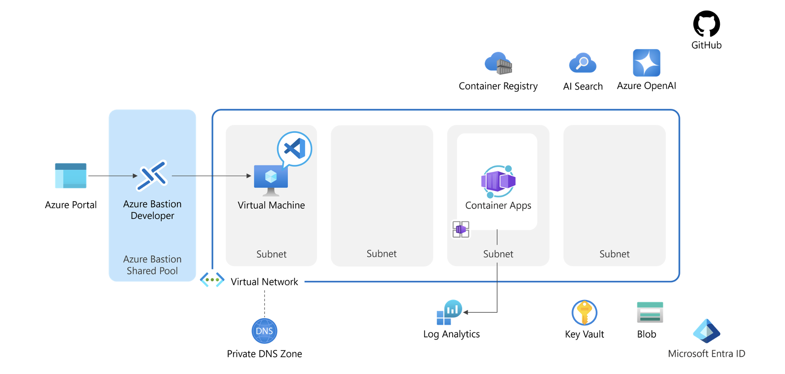

 

### ディレクトリ構成

┣ .github  
┃   ┗ workflows (ワークフロー)  
┣ app  
┃   ┣ csharp  
┃   ┃   ┗ simple (C# 版シンプルなサンプルアプリ)  
┃   ┗ python (Bicep パラメーター)  
┃   ┃   ┗ simple (Python 版シンプルなサンプルアプリ)  
┣ bicep  
┃   ┣ modules (Bicep モジュール)  
┃   ┣ parameters (Bicep パラメーター)  
┃   ┗ templates (Bicep テンプレート)  
┣ contents (サンプル ファイル)  
┣ Before-the-HOL.md  
┣ HOL step-by-step Guide.md  
┗ README.md  

### 事前準備手順書

本ハンズオンは、事前に Azure リソースを展開して実施することを想定して作成されました。

事前に展開するリソース一覧は、下図の通りです。

Azure リソースの展開手順は、[こちら](./Before-the-HOL.md)をご覧ください。

### API 仕様

ハンズオン内では、RAG アプリケーションを体験いただくために、いくつかの API を事前に構成済みです。

API 仕様書は[こちら](https://kohei3110.github.io/RAG-on-Azure-Hands-on-Lab/)をご覧ください。